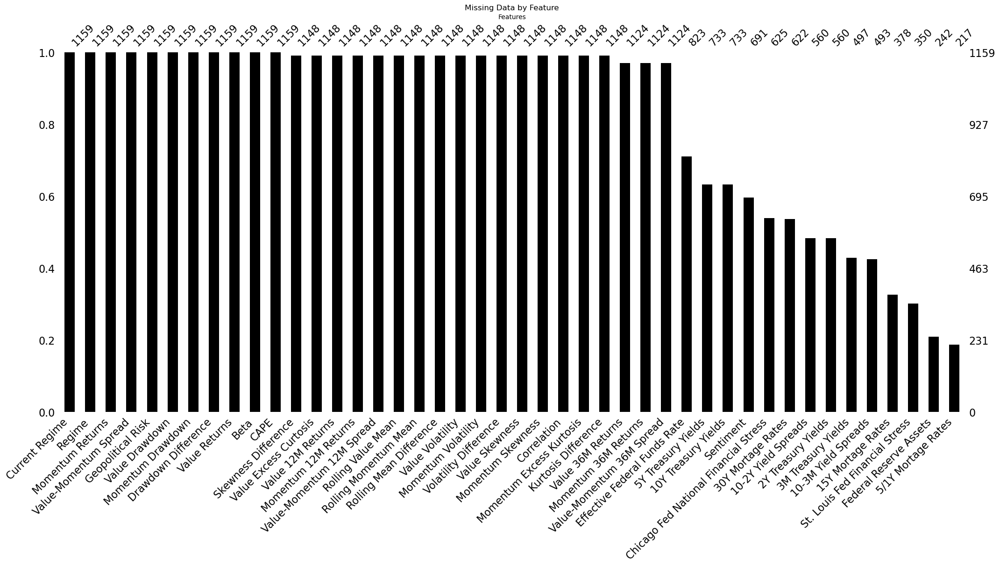

# Financial Market Regime Classification

  

  <i>Cross-Asset Value vs. Momentum</i>

Following the financial crisis, quantitative cross-sectional value strategies, expecially in equities, have experienced a decade of relative underperformance, making it challenging to maintain commitment to them. This repository aims to identify correponding regimes and implement tactical allocation changes based on four distinct supervised machine learning methods for binary (Value vs. Momentum) regime classification.
Due to the results of [Fernández-Delgado et al. (2014)](https://jmlr.org/papers/v15/delgado14a.html), we focused on the following methods:

- Logistic Regression (baseline model)
- Random Forest
- Support Vector Machine
- Multi-layer Perceptron

## Theory

### Value vs. Momentum

- **Value** is a strategy that focuses on securities with cheap fundamentals, such as low price-to-earnings ratios. The idea is that these undervalued securities will mean-revert in price. This approach is based on the idea that while the market may not accurately price a security's true value in the short term, over the long term its price will converge back to its true value.

- **Momentum** focuses on the recent price performance of securities, assuming that those with strong recent performance will continue to perform strong in the future, and vice versa. This approach is based on the idea that market trends and investor sentiment can drive the price of a security, and these trends may persist for some time before reversing. Side remark: Momentum is not Growth, the actual antagonist of Value.

Both strategies typically exhibit negative correlation, as value is countercyclical while momentum is procyclical. Consequently, we will divide the current market state along this cycle-based value vs. momentum dimension. That both are, on average, profitable — which may appear counterintuitive — can be explained by value operating on longer-term time frames, while momentum operates on shorter-term time frames.

### Methods

- **Logistic Regression** (LPB): This is one of the most fundamental models, especially for binary classification problems, such as the one in this case. The basic principle is to use a sigmoid function to model the probability of occurrence of a particular class y, given X. The sigmoid function takes real numbers as input and outputs values in the range [0, 1], allowing the output to be interpreted as a probability.

$$ P(Y=1|X) = \frac{1}{1 + e^{-(\beta_0 + \beta_1 X_1 + \beta_2 X_2 + ... + \beta_n X_n)}} $$

- **Support Vector Machines** (SVM): These are a family of supervised learning algorithms used for classification and regression problems. In the context of binary classification, SVMs attempt to find an optimal hyperplane that separates the two classes. Specifically, we use the C-Support Vector Classification (C-SVC) variant because it is particularly good at avoiding overfitting based on the regularization hyper paramater 'C'. Technically, it controls the trade-off between achieving the largest possible margin and minimizing classification errors.

$$ f(X) = sign\left(\sum_{i} α_i * y_i * K(X_i, X) - ρ\right) $$

- **Random Forest** (RF): This is a bagging based ensemble technique, which creates an ensemble of multiple decision tree models and uses the majority decision of these trees for prediction. Each individual tree in the Random Forest is trained on a random subset of the training data (called bootstrap samples) and uses a random selection of features to find the best split at each node of the tree. This randomness leads to increased diversity among individual trees and helps decreasing variance.

$$ f(x) = mode\left({T_1(x), T_2(x), ..., T_B(x)}\right) $$

- **Multi-layer Perceptron** (MLP): These are a type of artificial neural network consisting of at least three layers of neurons: an input layer, one or more "hidden" layers, and an output layer. Each layer is fully connected to the next, with each node receiving a weighted sum of inputs from the previous layer to which an activation function is applied.

$$ f(X) = \sigma\left( w^{[3]} \cdot \sigma\left( w^{[2]} \cdot \sigma\left( w^{[1]} X + b^{[1]} \right) + b^{[2]} \right) + b^{[3]} \right) $$

Tuning and selection of these models was done by cross-validation based on binary [cross entropy](https://en.wikipedia.org/wiki/Cross_entropy) instead of accuracy, because in finance not only the number of correct classifications is important, but also the corresponding probabilities.

$$ H_{b}(y, \hat{y}) = -y \cdot log(\hat{y}) - (1 - y) \cdot log(1 - \hat{y}) $$

## Data

From the [AQR Capital Management database](https://www.aqr.com/Insights/Datasets/Century-of-Factor-Premia-Monthly), we had access to monthly returns for both strategies dating back to 1926. Using this data, we extracted additional features, including rolling cumulative performance, volatility, and correlation. We supplemented them with key financial macroeconomic indicators sourced from the [FRED database](https://stlouisfed.shinyapps.io/macro-snapshot/#financial).

The data from the latter varied in length, confronting us with a challenging trade-off - should we prioritize having more features or more historical data? To resolve this, we conducted a bootstrapping test. The purpose of this was to ascertain whether shorter feature time series were redundant (null hypothesis) and therefore could be discarded in favor of having more historical data, or not (alternative hypothesis).
The null hat to be rejected multiple times. Consequently, we repeated the models' training and testing process multiple times, using different data sets along the described trade-off.

This iterative approach gave us the opportunity to observe and understand how this trade-off played out in our specific case.

  

  <i>Unbalanced Data</i>

## Results

In each case, the dataset was split 70/30 into a training and a test dataset, with the former used for hyperparameter tuning, feature selection, etc., and the latter used exclusively to test the performance of the Tactical Asset Allocation (TAA) models.
To evaluate them, we tested their respective Sharpe Ratios (SR) against the Sharpe Ratio of a naive 50/50 portfolio (BM) according to the following pair of hypotheses using a bootstrapping test, assuming monthly rebalancing and no transaction costs.

$$ H_0 : SR_{TAA} \leq SR_{BM} $$

$$ H_1 : SR_{TAA} > SR_{BM} $$

### Time Period 1 (2003-2023 | 43 Features)

#### Cumulative Performance

#### Sharpe Ratio

- **Logistic Regression** p-value: 52.25%
- **Support Vector Machine** p-value: 61.72%
- **Random Forest** p-value: 59.88%
- **Multi-layer Perceptron** p-value: 46.12%

  

  <i>Models Sharpe Rattios vs. Benchmark Sharpe Ratios (2003-2023)</i>

### Time Period 2 (1976-2023 | 36 Features)

#### Cumulative Performance

#### Sharpe Ratio

- **Logistic Regression** p-value: 52.25%
- **Support Vector Machine** p-value: 61.72%
- **Random Forest** p-value: 59.88%
- **Multi-layer Perceptron** p-value: 46.12%

  

  <i>Models Sharpe Rattios vs. Benchmark Sharpe Ratios (1976 - 2023)</i>

### Time Period 3 (1971-2023 | 34 Features)

#### Cumulative Performance

#### Sharpe Ratio

- **Logistic Regression** p-value: 49.88%
- **Support Vector Machine** p-value: 25.52%
- **Random Forest** p-value: 37.50%
- **Multi-layer Perceptron** p-value: 68.74%

  

  <i>Models Sharpe Rattios vs. Benchmark Sharpe Ratios (1971 - 2023)</i>

### Time Period 4 (1965-2023 | 33 Features)

#### Cumulative Performance

#### Sharpe Ratio

- **Logistic Regression** p-value: 52.86%
- **Support Vector Machine** p-value: 54.15%
- **Random Forest** p-value: 44.20%
- **Multi-layer Perceptron** p-value: 78.83%

### Time Period 5 (1954-2023 | )

#### Cumulative Performance

#### Sharpe Ratio

- **Logistic Regression** p-value: 52.86%
- **Support Vector Machine** p-value: 54.15%
- **Random Forest** p-value: 44.20%
- **Multi-layer Perceptron** p-value: 78.83%

### Time Period 6 (1929 - 2023)

#### Cumulative Performance

#### Sharpe Ratio

#### Links

- [Federal Reserve Economic Data](https://fred.stlouisfed.org/)
- [Online Data by Robert Shiller](http://www.econ.yale.edu/~shiller/data.htm)
- [How Do Factor Premia Vary Over Time? (Factor Data Monthly)](https://www.aqr.com/Insights/Datasets/Century-of-Factor-Premia-Monthly)
- [Classifying market regimes (Macrosynergy Research)](https://research.macrosynergy.com/classifying-market-regimes/)
- [Time Series Forecasting as Supervised Learning](https://machinelearningmastery.com/time-series-forecasting-supervised-learning/)
- [Random Forest for Time Series Forecasting](https://machinelearningmastery.com/random-forest-for-time-series-forecasting/)
- [How to Develop Multilayer Perceptron Models for Time Series Forecasting](https://machinelearningmastery.com/how-to-develop-multilayer-perceptron-models-for-time-series-forecasting/)
- [Return Data](https://www.aqr.com/Insights/Datasets/Century-of-Factor-Premia-Monthly)

## Conclusion

